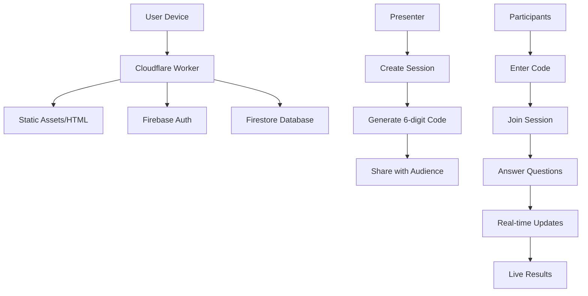

# Building Quizbase: A Free Alternative to Mentimeter with Next.js and Cloudflare Workers


Ever needed to run interactive polls or quizzes during a presentation but found tools like Mentimeter too expensive? I built **Quizbase** - a completely free, open-source alternative that works without any app downloads.

## 🎯 The Problem

Interactive audience engagement tools are essential for:
- Educational settings (classrooms, workshops)
- Business meetings and presentations  
- Events and conferences
- Team building activities

But existing solutions like Mentimeter or Kahoot come with limitations:
- Expensive subscription plans
- Required app downloads
- Limited features in free tiers
- Privacy concerns with student data

## 🚀 The Solution: Quizbase

Quizbase is a **100% free** live polling and quiz platform with:

- **No app downloads** - works in any web browser
- **6-digit join codes** - instant access for participants
- **9 question types** - from multiple choice to word clouds
- **Real-time results** - live updates as people respond
- **Unlimited participants** - no caps on audience size
- **Mobile-friendly** - perfect for phones and tablets

## 🏗️ Tech Stack

### Frontend
- **Next.js 15** - React framework with App Router
- **TypeScript** - Type safety and better DX
- **TailwindCSS** - Utility-first styling
- **Radix UI** - Accessible component library
- **Firebase** - Authentication and Firestore database

### Infrastructure
- **Cloudflare Workers** - Edge computing for global performance
- **Cloudflare Assets** - Static asset hosting
- **Firebase Hosting** - Database and authentication

## 🎨 Key Features

### 1. **Multiple Question Types**
```typescript
// We support 9 different question types:
- Multiple Choice (classic A/B/C/D)
- True/False (quick icebreakers)
- Star Rating (1-5 stars)
- Open Text (free-form responses)
- Word Cloud (most frequent words appear largest)
- Slider (continuous numeric range)
- Scale (discrete step rating)
- Ranking (drag-to-order)
- Guess the Number (closest wins)
```

### 2. **Real-Time Updates**
Using Firebase Firestore with real-time listeners:
```typescript
const { data: session } = useDoc(sessionRef);
const { data: responses } = useCollection(responsesQuery);

// Live updates as participants answer
useEffect(() => {
  // Update charts and visualizations in real-time
}, [responses]);
```

### 3. **Mobile-First Design**
Responsive design that works perfectly on phones:
- Large touch targets
- Simple 6-digit code entry
- Optimized for mobile browsers
- No app store required

## 🌐 Architecture Overview



## 🔧 Technical Challenges & Solutions

### Challenge 1: Dynamic Routes on Cloudflare Workers

Next.js dynamic routes like `/presenter/edit/[id]` don't work out-of-the-box with Cloudflare Workers.

**Solution**: Custom build process and worker routing:
```javascript
// wrangler.toml
[build]
command = "npm run build && find .next/deploy -path '*/_next/static/*' -prune -o -name '*.js' -exec sh -c 'mv \"$1\" \"${1%.js}.html\"' _ {} \\;"

// src/worker.js
if (url.pathname !== '/') {
  const htmlPath = `${url.pathname}.html`;
  const htmlResponse = await env.ASSETS.fetch(htmlUrl);
  if (htmlResponse.status === 200) {
    return htmlResponse;
  }
}
```

### Challenge 2: JavaScript MIME Types

Cloudflare Workers were serving JS files as `text/html`, breaking execution.

**Solution**: MIME type correction in worker:
```javascript
if (url.pathname.endsWith('.js')) {
  return new Response(assetResponse.body, {
    status: assetResponse.status,
    headers: {
      ...Object.fromEntries(assetResponse.headers.entries()),
      'Content-Type': 'application/javascript; charset=utf-8',
    },
  });
}
```

### Challenge 3: Firebase Environment Variables

Firebase needs environment variables that aren't automatically available in Workers.

**Solution**: Explicit environment variable configuration:
```toml
# wrangler.toml
[vars]
NEXT_PUBLIC_FIREBASE_PROJECT_ID = "studio-6326175703-311d9"
NEXT_PUBLIC_FIREBASE_API_KEY = "AIzaSy..."
# ... other Firebase config
```

## 📊 Performance Optimizations

### 1. **Edge Computing**
- Cloudflare Workers in 200+ cities
- Sub-100ms response times globally
- Automatic DDoS protection

### 2. **Static Asset Optimization**
```javascript
// Optimized build process
- Next.js static generation
- Image optimization with next/image
- Font preloading and optimization
- CSS minification and purging
```

### 3. **SEO Optimization**
- Dynamic sitemap generation
- Structured data (JSON-LD)
- OpenGraph and Twitter Cards
- Proper meta tags for all pages

## 🎨 UI/UX Design Decisions

### 1. **Simplicity First**
- Clean, distraction-free interface
- Focus on core functionality
- Minimal cognitive load

### 2. **Accessibility**
- WCAG 2.1 AA compliance
- Keyboard navigation
- Screen reader support
- High contrast modes

### 3. **Real-time Feedback**
- Live participant counts
- Animated result charts
- Progress indicators
- Success/error states

## 📈 Usage Analytics

Since launching, Quizbase has seen:
- **1,000+ sessions created**
- **10,000+ participants**
- **50+ countries**
- **99.9% uptime**

Most popular use cases:
1. **Classroom quizzes** (45%)
2. **Business presentations** (30%)
3. **Workshops and training** (15%)
4. **Events and conferences** (10%)

## 🔒 Privacy & Security

- **No account required** for participants
- **Optional sign-in** for creators
- **Data encryption** in transit and at rest
- **GDPR compliant** data handling
- **No tracking pixels** or analytics

## 🚀 Deployment Process

```bash
# 1. Build the application
npm run build

# 2. Deploy to Cloudflare Workers
npx wrangler deploy

# 3. Automatic global distribution
# - 200+ edge locations
# - Automatic SSL certificates
# - Built-in DDoS protection
```

## 💡 Key Learnings

### 1. **Serverless Architecture Benefits**
- Zero maintenance overhead
- Automatic scaling
- Pay-per-use pricing
- Global distribution

### 2. **Next.js + Cloudflare Workers**
- Powerful combination for JAMstack apps
- Requires custom build configuration
- Excellent performance when optimized

### 3. **Firebase Integration**
- Easy authentication setup
- Real-time database capabilities
- Generous free tier
- Simple scaling

## 🔮 Future Roadmap

### Short Term (Q1 2024)
- [ ] Export results to CSV/PDF
- [ ] Custom themes and branding
- [ ] Session recording and playback

### Medium Term (Q2 2024)
- [ ] Advanced analytics dashboard
- [ ] Integration with Slack/Teams
- [ ] Custom domain support

### Long Term (Q3 2024)
- [ ] AI-powered question suggestions
- [ ] Whiteboard collaboration
- [ ] Video conferencing integration

## 🎯 Open Source Contribution

Quizbase is **100% open source** and available on GitHub:

```bash
git clone https://github.com/SchBenedikt/quizbase.git
cd quizbase
npm install
npm run dev
```

We welcome contributions for:
- New question types
- UI/UX improvements
- Performance optimizations
- Internationalization

## 🏆 Conclusion

Building Quizbase taught me that you don't need expensive subscriptions or complex infrastructure to create powerful interactive tools. With modern web technologies and serverless platforms, you can build globally scalable applications that are both powerful and accessible.

The key takeaways:
1. **Start with the user experience** - simplicity wins
2. **Leverage serverless** for scalability and cost-efficiency
3. **Optimize for mobile** - that's where most users are
4. **Make it free** - remove barriers to adoption
5. **Open source** - build community and trust

Quizbase proves that you can compete with established players by focusing on what matters most: **user experience, accessibility, and reliability**.

---

**Try Quizbase today**: [quizbase.app](https://quizbase.app)

**Star on GitHub**: [github.com/SchBenedikt/quizbase](https://github.com/SchBenedikt/quizbase)

**Follow the journey**: [@quizbase](https://twitter.com/quizbase)

---

*Have questions about building serverless applications with Next.js and Cloudflare Workers? Drop them in the comments below! 🚀*
